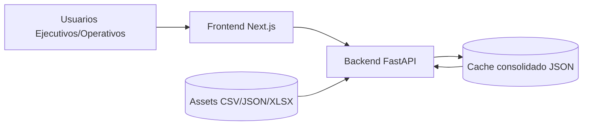
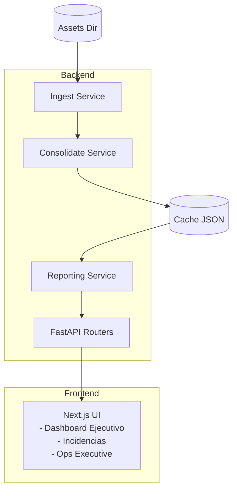
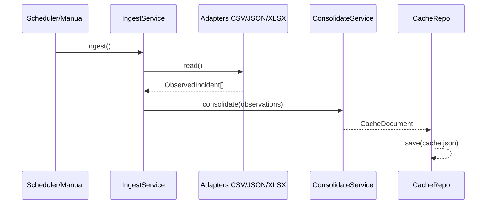
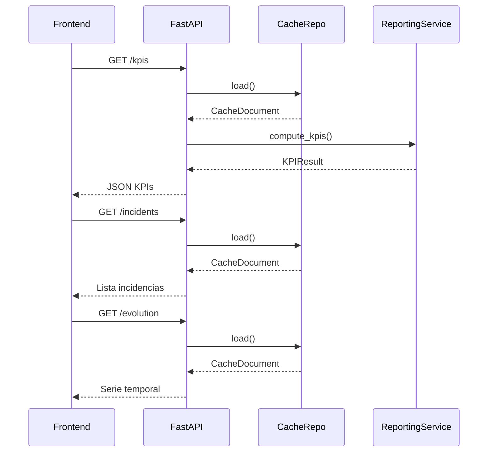

# Arquitectura de Global Overview Radar

Este documento describe la arquitectura técnica y funcional de Global Overview Radar, incluyendo módulos, flujos de datos, puntos de integración y consideraciones de operación.

---

## 1) Visión general

Global Overview Radar es una plataforma full‑stack con dos grandes subsistemas:

- **Backend (Python/FastAPI)**: ingestión de fuentes, consolidación y API.
- **Frontend (Next.js)**: paneles ejecutivos y operativos.

El backend genera un **cache consolidado** (JSON) que sirve de base para los KPIs y vistas operativas. El frontend consume la API y ofrece la experiencia de usuario.

---

## 2) Arquitectura de alto nivel (C4 - Context)



---

## 3) Contenedores principales (C4 - Containers)



---

## 4) Dominios y módulos

### Backend
- **Adapters** (`adapters/*`): Lectura de fuentes CSV/JSON/XLSX.
- **Services** (`services/*`):
  - `IngestService`: Orquesta adaptadores y recopila observaciones.
  - `ConsolidateService`: Unifica incidencias, mantiene historial y procedencia.
  - `ReportingService`: Calcula KPIs, evolución y métricas.
- **Domain** (`domain/*`): Modelos, enums y lógica de KPI.
- **Repositories** (`repositories/*`): Persistencia del cache.
- **API** (`api/*`): Endpoints de KPIs, incidencias y evolución.

### Frontend
- **Pages** (`src/app/*`): Dashboard, incidencias y Ops.
- **Components** (`src/components/*`): Shell, cards, charts, etc.
- **Lib** (`src/lib/*`): API client y tipos compartidos.

---

## 5) Flujo de ingestión y consolidación



**Reglas clave de consolidación**
- `global_id` determinista (source_id + source_key).
- Se actualiza `current` en cada observación.
- Se agrega `history` si hay cambios relevantes.
- Se mantiene `provenance` por origen.

---

## 6) Flujo de lectura (API + Frontend)



---

## 7) Modelo de datos (resumen)

```mermaid
classDiagram
  class ObservedIncident {
    source_id
    source_key
    observed_at
    title
    status
    severity
    opened_at
    closed_at
    updated_at
    clients_affected
    product
    feature
  }

  class IncidentRecord {
    global_id
    current
    provenance[]
    history[]
  }

  class CacheDocument {
    generated_at
    runs[]
    incidents{}
  }

  ObservedIncident --> IncidentRecord : consolidates to
  CacheDocument --> IncidentRecord : contains
```

---

## 8) Configuración y parámetros

Controlados desde `.env`:
- `ASSETS_DIR`: origen de ficheros.
- `CACHE_PATH`: JSON consolidado.
- `SOURCES`: lista activa de fuentes.
- `MASTER_THRESHOLD_CLIENTS`, `STALE_DAYS_THRESHOLD`, `PERIOD_DAYS_DEFAULT`.

---

## 9) Testing y calidad

- Backend: `pytest` + `pytest-cov` (coverage >= 70%).
- Frontend: `vitest` + `@testing-library/*` (coverage >= 70%).
- Lint: `ruff` (backend) + `eslint` (frontend).
- Typecheck: `mypy`/`pyright` y `next build`.

---

## 10) Seguridad y cumplimiento

- CORS configurado para entornos locales/lan.
- Control de acceso aún no implementado (sugerido en roadmap).
- Recomendado: autenticación, auditoría y cifrado en repositorio si se integran datos sensibles.

---

## 11) Observabilidad (sugerido)

- Logging estructurado (JSON).
- Métricas de ingestión y tiempo de respuesta.
- Alertas sobre incidentes críticos y stale.

---

## 12) Roadmap técnico

- Persistencia en base de datos relacional o documental.
- Jobs de ingestión programados (cron/queue).
- Conectores corporativos (Jira/ServiceNow).
- Control de acceso y roles.
- Analítica avanzada (SLA, MTTR, cohortes).

---

## 13) FAQ

**¿Dónde se calcula la evolución temporal?**
En `api/routers/evolution.py` a partir del cache consolidado.

**¿Puedo añadir una nueva fuente?**
Sí, implementando un nuevo Adapter y activándolo en `SOURCES`.

**¿El cache es el único storage?**
Actualmente sí, pensado para prototipos y cargas medias. Para producción, se recomienda DB.
