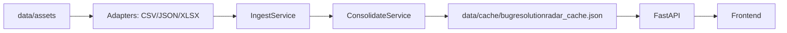
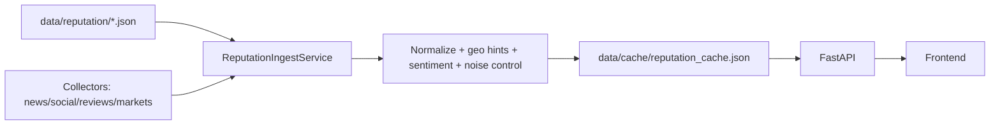
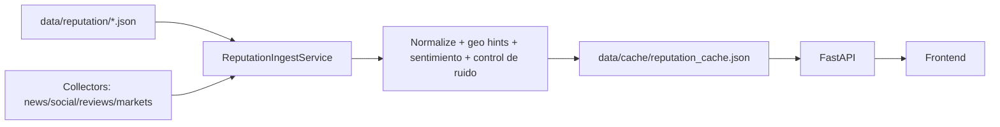

# ARCHITECTURE.md (EN / ES)

Entry points:
- System guide: `DOCUMENTACION.md`
- Data contracts: `DATA_CONTRACTS.md`
- Extension guide: `EXTENDING_THE_SYSTEM.md`
- File index: `FILES.md`

---

## EN | Architecture today

Global Overview Radar runs two complementary pipelines on top of a shared API layer:

1) BugResolutionRadar (incident intelligence)
- Ingests structured files from `data/assets` (CSV/JSON/XLSX).
- Normalizes and consolidates incidents into a cache.
- Exposes KPIs, incident lists, and evolution endpoints.

2) Reputation Radar (public signals)
- Collects public items from multiple sources (news, social, reviews, app stores).
- Uses mergeable business configs from `data/reputation/*.json`.
- Normalizes, enriches (geo hints + sentiment), applies noise controls, and caches results.
- Exposes reputation items and comparison endpoints.

### End-to-end flow (BugResolutionRadar)

### End-to-end flow (Reputation)

### Configuration at a glance

- Backend env files live in:
  - `backend/bugresolutionradar/.env`
  - `backend/reputation/.env.reputation`
- Reputation configs are **multi-file** by design: drop one or many JSONs in `data/reputation/`.
- Merge rules: dicts merge deep, lists de-duplicate, scalars override when non-empty.
- UI flags can disable Incidencias/Ops per business scope (`ui.incidents_enabled`, `ui.ops_enabled`).

---

## ES | Arquitectura actual

Global Overview Radar ejecuta dos pipelines complementarios sobre una API compartida:

1) BugResolutionRadar (incidencias)
- Ingesta ficheros estructurados desde `data/assets` (CSV/JSON/XLSX).
- Normaliza y consolida incidencias en cache.
- Expone KPIs, listados y evolucion.

2) Reputation Radar (senales publicas)
- Recolecta items publicos desde multiples fuentes.
- Usa configuraciones mergeables en `data/reputation/*.json`.
- Normaliza, enriquece (geo + sentimiento), aplica control de ruido y cachea resultados.
- Expone endpoints de reputacion y comparativas.

### Flujo end-to-end (BugResolutionRadar)

### Flujo end-to-end (Reputacion)

### Configuracion

- .env backend:
  - `backend/bugresolutionradar/.env`
  - `backend/reputation/.env.reputation`
- Reputacion usa **multi-config**: uno o varios JSON en `data/reputation/`.
- Reglas de merge: dicts merge profundo, listas deduplicadas, escalares override si no estan vacios.
- Flags de UI pueden deshabilitar Incidencias/Ops por scope (`ui.incidents_enabled`, `ui.ops_enabled`).
