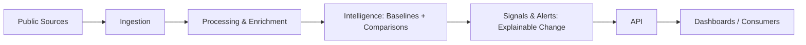
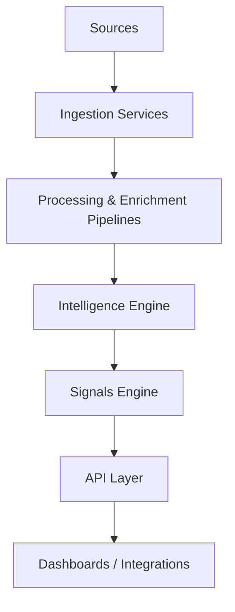
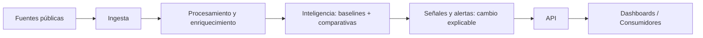

# 🏗️ ARCHITECTURE.md (EN / ES)

> **Entry points / Puntos de entrada**
- System documentation / Documentación del sistema: [`DOCUMENTACION.md`](DOCUMENTACION.md)
- Data contracts / Contratos de datos: [`DATA_CONTRACTS.md`](DATA_CONTRACTS.md)
- Signals catalog / Catálogo de señales: [`SIGNALS_CATALOG.md`](SIGNALS_CATALOG.md)
- Governance & security / Gobierno y seguridad: [`GOVERNANCE_SECURITY.md`](GOVERNANCE_SECURITY.md)
- Extending / Extender: [`EXTENDING_THE_SYSTEM.md`](EXTENDING_THE_SYSTEM.md)

---

## EN | Architecture at a glance

Global Overview Radar is built as a **layered, event-driven intelligence pipeline**:
- capture public discourse
- enrich it semantically
- compute **relative** intelligence
- detect **change** as explainable signals
- expose insights via API and dashboards

### End-to-end flow (Mermaid)



### C4 — Context

```mermaid
graph TD
  ENV[Public Environment<br/>(Media, Social, Institutional)] --> RADAR[Global Overview Radar]
  RADAR --> USERS[Teams & Decision Makers<br/>(Reputation, Strategy, Risk, Public Affairs)]
```

### C4 — Containers



### Design principles
- **Comparative by design** (no absolute insights)
- **Signals over noise** (focus on change: acceleration/divergence/emergence)
- **Explainability first** (why/compared-to/since-when/evidence)
- **Reproducibility** (immutable raw + reprocessable derivations)
- **Configuration over hardcoding** (taxonomies/peers/markets drive meaning)

---

## ES | Arquitectura de un vistazo

Global Overview Radar se construye como un **pipeline de inteligencia por capas y orientado a eventos**:
- captura discurso público
- lo enriquece semánticamente
- calcula inteligencia **relativa**
- detecta **cambio** como señales explicables
- expone insights vía API y dashboards

### Flujo end-to-end (Mermaid)



### Principios de diseño
- **Comparativo por diseño** (sin insights absolutos)
- **Señales por encima del ruido** (cambio: aceleración/divergencia/emergencia)
- **Explainability first** (por qué / respecto a qué / desde cuándo / evidencia)
- **Reproducibilidad** (raw inmutable + derivados reprocesables)
- **Configuración sobre hardcoding** (taxonomías/peers/mercados)

---

## EN | Core data objects (logical)
See full contracts in [`DATA_CONTRACTS.md`](DATA_CONTRACTS.md).

- `ContentEvent` (immutable raw)
- `EnrichedContent` (derived, reprocessable)
- `ComparativeScore` (relative metrics)
- `SignalEvent` (explainable change event)

---

## ES | Objetos de datos (lógicos)
Ver contratos completos en [`DATA_CONTRACTS.md`](DATA_CONTRACTS.md).

- `ContentEvent` (raw inmutable)
- `EnrichedContent` (derivado, reprocesable)
- `ComparativeScore` (métricas relativas)
- `SignalEvent` (evento de cambio explicable)
