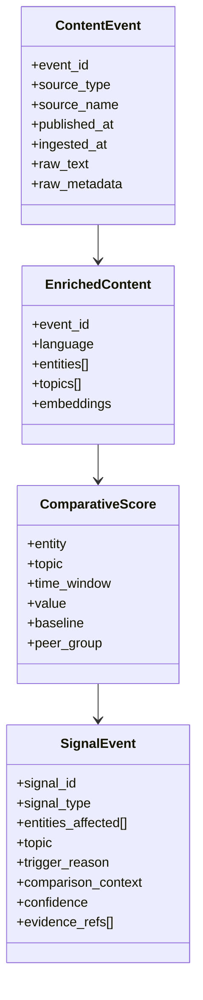

# DATA_CONTRACTS.md (EN / ES)

Logical contracts used across the system. These are storage-agnostic schemas designed for traceability and reproducibility.

Back to architecture: [`ARCHITECTURE.md`](ARCHITECTURE.md)

---

## EN | Contract philosophy
- Raw content is **immutable**
- Derived artifacts are **reprocessable**
- Every insight must be **traceable** to evidence

## ES | Filosofía
- El contenido raw es **inmutable**
- Los derivados son **reprocesables**
- Todo insight debe ser **trazable** a evidencia

---

## Core objects (Mermaid)

---

## EN | Minimal fields (recommended)

### ContentEvent
- `event_id`, `published_at`, `source_type`, `raw_text`, `raw_metadata`

### EnrichedContent
- `language`, `entities`, `topics`, `embeddings` (optional)

### ComparativeScore
- `value`, `baseline`, `peer_group`, `time_window`

### SignalEvent
- `signal_type`, `trigger_reason`, `comparison_context`, `evidence_refs`, `confidence`

---

## ES | Campos mínimos (recomendado)

### ContentEvent
- `event_id`, `published_at`, `source_type`, `raw_text`, `raw_metadata`

### EnrichedContent
- `language`, `entities`, `topics`, `embeddings` (opcional)

### ComparativeScore
- `value`, `baseline`, `peer_group`, `time_window`

### SignalEvent
- `signal_type`, `trigger_reason`, `comparison_context`, `evidence_refs`, `confidence`
