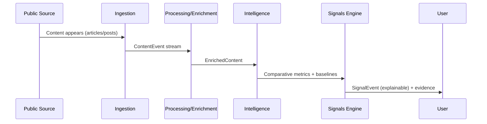

# SIGNALS_CATALOG.md (EN / ES)

Catalog of explainable signal types. Signals represent **change**, not volume.

Back to architecture: [`ARCHITECTURE.md`](ARCHITECTURE.md)

---

## EN | Signal lifecycle (Mermaid)

---

## EN | Signal types (core)

### 1) Acceleration
Detect abnormal growth in topic velocity relative to baseline and peers.

### 2) Divergence
Entity framing/exposure diverges from peer group.

### 3) Emergence
New topic crosses relevance thresholds (often high sensitivity).

### 4) Polarity / Framing Shift
Structural change in how a topic is framed (tone or narrative lens).

### 5) Saturation / Fatigue (optional)
Overexposure risk: topic dominates beyond healthy baseline.

Each signal must include:
- what changed
- compared to what (baseline/peers)
- since when (time window)
- evidence (top supporting content)
- confidence

---

## ES | Tipos de señal (core)

### 1) Aceleración
Crecimiento anómalo de velocidad vs baseline y peers.

### 2) Divergencia
Framing/exposición de una entidad se separa del peer group.

### 3) Emergencia
Nuevo tema cruza umbrales de relevancia (a menudo sensible).

### 4) Cambio de framing / polaridad
Cambio estructural de cómo se interpreta el tema.

### 5) Saturación / fatiga (opcional)
Riesgo por sobreexposición: domina más allá del baseline.

Cada señal incluye:
- qué cambió
- respecto a qué (baseline/peers)
- desde cuándo (ventana temporal)
- evidencia (top piezas)
- confianza
